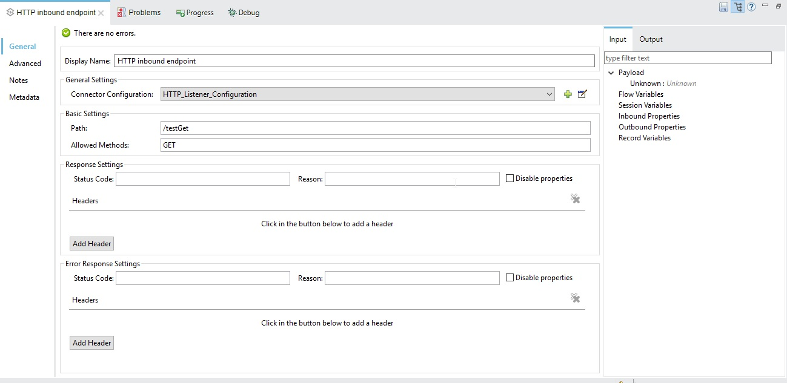
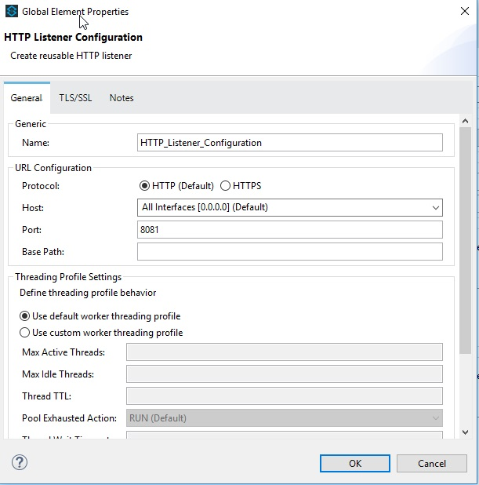
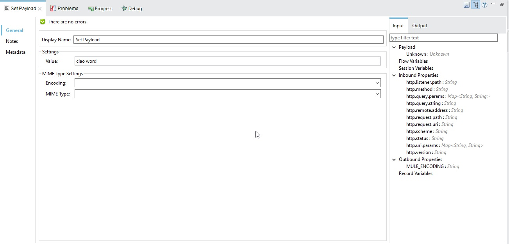
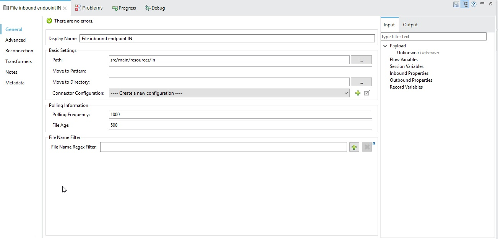
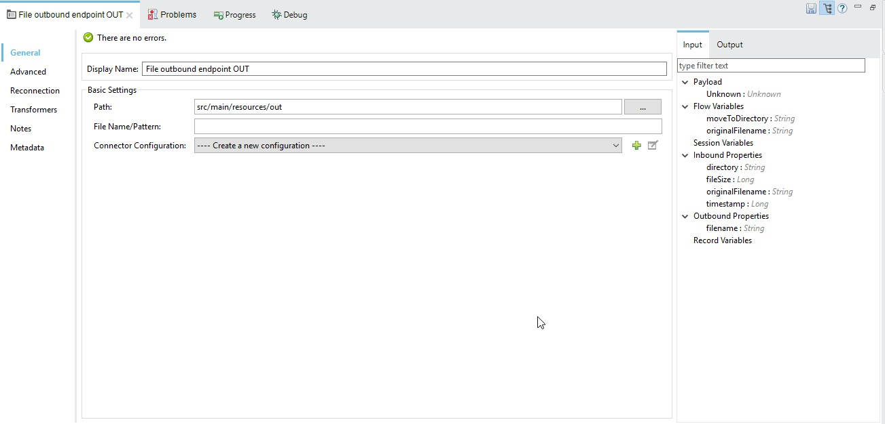
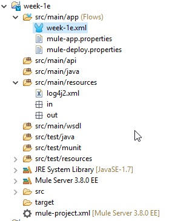

# Week-1 Start with Mule 

HINT: 
- Configurations for Http Server for hello world
- Configurations File transfer

You can find the video by following this path:
\\wmilnufs01.miln.it.sopra\E\users\dzaza\public\MuleCourse\Week1

All flows:

Configurations for Http Server for hello world

Configuration for http inbound endpoint

Http Listener Configuration

Configuration for Set Payload

Configurations for File transfer

Configuration File inbound endpoint from folder IN

Configuration File outbound endpoint to folder OUT

The project

